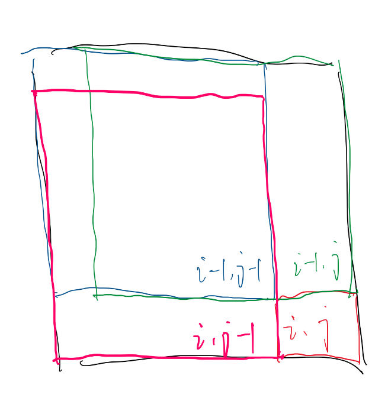

# LeetCode题目记录

## PART1 动态规划

### 152.乘积最大子数组
[link](https://leetcode.cn/problems/maximum-product-subarray/)

#### 1.从前缀的角度考虑

可以参考[53.最大子数组和](https://leetcode.cn/problems/maximum-subarray/)的前缀和解法和思路，会遇到问题，当`prefix[i]`和`prefix[j]`都等于`0`时，无法通过除法计算`product-subarray[i][j]`

#### 2.动态规划

同样可以参考上面题目的动态规划思路，但是要对正负情况分类讨论。

- 当前数字为负数时

  $maxProductSubarray[i]=minProductSubarray[i-1]>1\;?\;nums[i]\;:\;minProductSubarray[i-1]*nums[i]$

- 当前数字为正数时

  $maxProductSubarray[i]=maxProductSubarray[i-1]<1\;?\;nums[i]\;:\;maxProductSubarray[i-1]*nums[i]$

因此需要记录`max`和`min`的子序列乘积。

`min`的情况相当简单，负数时，将该负数取反，计算正数情况下的最大值，再取反即得到最小值；正数时同理。


### 198.打家劫舍

[link](https://leetcode.cn/problems/house-robber/)

#### 1.动态规划

**动态规划的核心**：找到可能的前驱(找到可能的后继)，然后自底向上。

题目的核心点在于不能连续盗取相邻的房屋，因此在到达房屋$i$时:
- 盗窃$i$，说明没有盗窃$i-1$
- 不盗窃$i$，盗不盗窃$i-1$都可以

于是有
$$
    \left\{
    \begin{array}{lr}
    dp[i][0] = max(dp[i-1][0],dp[i-1][1]) \\ 
    dp[i][1] = dp[i-1][0] + a[i]
    \end{array}
    \right.
$$

### 212.打家劫舍II

[link](https://leetcode.cn/problems/house-robber-ii/)

#### 1.动态规划

和[打家劫舍](##198.打家劫舍)的区别仅在于首尾是否连接

- 当盗窃最后一家时，说明没有盗窃第一家
- 当不盗窃最后一家时，第一家盗不盗窃无所谓

因此$dp[last][0]$的计算方式不变，$dp[last][1]$则抛弃第一家，从第二家开始考虑既不用考虑首位相接的问题，可以按照之前的计算方式计算。


### 221.最大正方形

[link](https://leetcode.cn/problems/maximal-square/submissions/)

#### 1.动态规划

关键在于如何**切分正方形**。



可以看出
$$
  dp[i][j]=1+min
  \left\{
  \begin{array}{lr}
  dp[i-1][j-1]\\
  dp[i][j-1]\\
  dp[i-1][j]
  \end{array}
  \right.
$$


## PART2 数据结构

### 203.移除链表元素

[链接](https://leetcode.cn/problems/remove-linked-list-elements/)

可以通过使用`dummy_head`来简化边缘判断的操作。

$dummy\_head \rightarrow real\_head$

### 19.删除链表的倒数第 N 个结点

[链接](https://leetcode.cn/problems/remove-nth-node-from-end-of-list/)

没有什么能节省时间复杂度的方法，遍历一次获取长度。

### 21.合并两个有序链表

[链接](https://leetcode.cn/problems/merge-two-sorted-lists/)

### 206.反转链表

[链接](https://leetcode.cn/problems/reverse-linked-list/)

注意反转链表的最后一个元素是原链表的第一个元素，如果原链表的长度超过1，说明第一个元素有后继，一定要让原第一个(反转后最后一个)元素的`next`为空，否则形成一个循环节。


### 92.反转链表II

[链接](https://leetcode.cn/problems/reverse-linked-list-ii/)

#### 1.一次遍历的方法

整体思想是：在需要反转的区间里，每遍历到一个节点，让这个新节点来到反转部分的起始位置。下面的图展示了整个流程。


### 24.两两交换链表中的节点

交换的关键在于$\rightarrow next$,改变`指针`本身不能完成链表结点顺序的交换，关键在于改变前后链接的关系。

### 430.扁平化多级双向链表

[链接](https://leetcode.cn/problems/flatten-a-multilevel-doubly-linked-list)

#### 1.使用stack

在找到含`child`的节点时就将该节点的`next(非空)`纳入`stack`中。相当于将递归方法使用栈实现。

### 445.两数相加II

[链接](https://leetcode.cn/problems/add-two-numbers-ii/solution/)

#### 1.使用stack

没有什么难点，理解cin不会超过1的原理即可，使用数学归纳法: 
> 第一位加法，假设最后两位都是9，和是18，cin为1，也就是说在最开始cin最大是1
> 假设cin最大不超过1，每一位计算最大为9+9+1=19,cin依然没超过1


### 23.合并K个升序链表

[链接](https://leetcode.cn/problems/merge-k-sorted-lists/)

#### 1.使用优先队列

结合`链表`与优先队列的特点，`链表`的一大特点就是根据当前节点不借助任何其他信息就可以得到其后继节点！！！
因此可以通过`优先队列`有效节省寻找当前开头最小的队列的问题，而且不会丢失后继。


## PART3 Hash和滑动窗口相关

### 217.存在重复元素

[链接](https://leetcode.cn/problems/contains-duplicate/)

无难点，使用hash表即可


### 219.存在重复元素II

[链接](https://leetcode.cn/problems/contains-duplicate-ii/)

无难点，使用hash表维护各个元素最后一次出现的位置即可

### 220.存在重复元素III

[链接](https://leetcode.cn/problems/contains-duplicate-iii)

#### 1.滑动窗口+有序集合

滑动窗口是最简单直观的暴力解法，用有序集合去维护。有序集合也可以针对上界或下界，再遍历符合要求的元素，去判断另一个界限。

#### 2.桶解法

**重点在于如何用==hash map==实现==桶==**
> 需要什么：
> - 从数字映射到桶
>   依据本题的要求，对于元素$x$，其影响的区间为$[x−t,x+t][x - t, x + t][x−t,x+t]$。可以设定桶的大小为$t+1$。如果两个元素同属一个桶，那么这两个元素必然符合条件。如果两个元素属于相邻桶，需要校验这两个元素是否差值不超过$t$。如果两个元素既不属于同一个桶，也不属于相邻桶，那么这两个元素必然不符合条件。
> 那么从数字映射到桶的方法就出现了，$bucketID=[\frac{num}{t+1}]$
> - 维护桶集合，因为要求下标的差小于$k$

```c++
class Solution {
public:
    int getID(int x, long w) {
        return x < 0 ? (x + 1ll) / w - 1 : x / w;
    }

    bool containsNearbyAlmostDuplicate(vector<int>& nums, int k, int t) {
        unordered_map<int, int> mp;
        int n = nums.size();
        for (int i = 0; i < n; i++) {
            long x = nums[i];
            int id = getID(x, t + 1ll);
            if (mp.count(id)) {
                return true;
            }
            if (mp.count(id - 1) && abs(x - mp[id - 1]) <= t) {
                return true;
            }
            if (mp.count(id + 1) && abs(x - mp[id + 1]) <= t) {
                return true;
            }
            mp[id] = x;
            if (i >= k) {
                mp.erase(getID(nums[i - k], t + 1ll));
            }
        }
        return false;
    }
};
```


### 290.单词规律

[链接](https://leetcode.cn/problems/word-pattern/)

无难度，hash表即可


### 594.最长和谐子序列

[链接](https://leetcode.cn/problems/longest-harmonious-subsequence)

#### 1.滑动窗口

排序后使用滑动窗口即可。

### 138.复制带随机指针的链表

[链接](https://leetcode.cn/problems/copy-list-with-random-pointer)

无难度，使用hash表记录复制的映射即可。

### 560.和为K的子数组

[链接](https://leetcode.cn/problems/subarray-sum-equals-k)

#### 1.前缀和+hash表

$prefix[i]-prefix[j -1 ]=k, j<=i$
只需要对每个$prefix[i]$找有多少个符合要求的$j$即可，可以使用`hash`表记录。

### 525.连续数组

[链接](https://leetcode.cn/problems/contiguous-array)

### 1.前缀和+hash表

可以参考[560.和为K的子数组](#560和为k的子数组)，仅需要做出一些调整。

> - 和是什么，本题要求区间中0和1的数量相等，那么就是说1对0的==净胜==为0，可以把1看作本方进球，0看作对方进球，**和**就是把这段区间的**净胜球**。把**0看作-1**可以有效地方便计算

### 128.最长连续序列

[链接](https://leetcode.cn/problems/longest-consecutive-sequence)

#### 1.排序

一般的解法

#### 2.hash表

由于本题限制时间复杂度为$O(N)$，所以直接用hash表记录数字，不断溯源。
**技巧**：溯源的时候从叶节点开始，可以是最小的(没有$self-1$)，最大的(没有$self+1$)，这样可以保证每个元素最多被追溯一次，不会出现多次记录的情况。

### 18.四数之和

[链接](https://leetcode.cn/problems/4sum/)

#### 1.双指针优化

主要思路是优化暴力的四重循环以及方便去重。

首先排序，最外面两层依然暴力循环，内部两层使用双指针优化。
去重的思路就是在每一层都取一个在这次循环中没有取过的数字。

## PART4 数与位相关

### 9.回文数

[链接](https://leetcode.cn/problems/palindrome-number)

> 注意将在`int`范围内的数字反转后可能超出`int`范围。

### 231.2的幂

[链接](https://leetcode.cn/problems/power-of-two/)

$$
n>0，
n\&(n-1)=0
$$

$$n>0,n\&(-n)=n$$

### 172.阶乘后的零

[链接](https://leetcode.cn/problems/factorial-trailing-zeroes)

将任意数字可以表示为一系列素数的乘积

$num=2^a*3^b*5^c*...$
而只有$2*5$素数相乘才能得到$10$，也就是结尾零，因此将任务转化为$n,(n-1),...,1$中能拆分出的$\min(2_{num},5_{num})$，而可知$2_{num}>5_{num}$，因此任务就变成了找$5_{num}$

$$5_{num}=\dfrac n {5}+\dfrac n {25}+ ...$$

### 476.数字的补数

[链接](https://leetcode.cn/problems/number-complement/)

> 要注意当数字为$2^{31}$时，大于它的$2^{power}$为$2^{32}$，超出了`int`的范围，使用`unsigned int`

### 319.灯泡开关

[链接](https://leetcode.cn/problems/bulb-switcher)

任何正整数$n$都可以拆解为$p*q$，那么一个灯泡就会在$p$和$q$两次动开关，抵消效果，除非$p=q$，也就是$n$是一个平方数，因此关键就是找平方数。

### 670.最大交换

[链接](https://leetcode.cn/problems/maximum-swap)

#### 1.贪心
每一位数字应该不小于所有排它后面的数字，否则找最大的且排最后面的数字与之交换


### 507.完美数

[链接](https://leetcode.cn/problems/perfect-number)

利用`sqrt`优化，同时考虑到`1`情况特殊，$1=1\times 1$


### 372.超级次方

[链接](https://leetcode.cn/problems/super-pow/)


#### 1.利用快速幂暴力做

#### 2.循环取余

~~来自高中的灵感~~,根据抽屉原理,$a^n$对$k$取余,当$n$的取值种类大于$k$时,一定会出现重复,这时就出现了循环。比如$a^p$和$a^q$对$k$同余，那么$a^{p+1}$和$a^{q+1}$对$k$也同余。

### 136.只出现一次的数字

[链接](https://leetcode.cn/problems/single-number/)

异或的性质，$0\oplus n=n$，$n\oplus n=0$


### 201.数字范围按位与

[链接](https://leetcode.cn/problems/bitwise-and-of-numbers-range/)

将$left$和$right$都用二进制表示:
$left\,\;=a_{32}a_{31}...a_1$
$right=b_{32}b_{31}...b_1$

从高位向低位看,如果截至某一位$k$时$a_k\ne b_k$，那么在$[left，right]$范围内一定发生了一次==跳跃==：
从$0111..1$跨越到了$1000..0$，所以范围内的数字按位与在该位及之后都是$0$。

因此目标就转化为找到$left$和$right$不一样的最高位。


#### 1.从高位开始往下走

#### 2.Barin Kernignhan算法


每次对 $number$和$number−1$之间进行按位与运算后，$number$中最右边的$1$会被抹去变成$0$

```python
class Solution:
    def rangeBitwiseAnd(self, m: int, n: int) -> int:
        while m < n:
            # 抹去最右边的 1
            n = n & (n - 1)
        return n
```

## PART5 栈与递归相关

### 682.棒球比赛

[链接](https://leetcode.cn/problems/baseball-game/)

无难度，注意负数的位移操作。

### 71.简化路径

[链接](https://leetcode.cn/problems/simplify-path)

无难度，注意细节，例如最后的路径结尾可能没有`\`，要记得处理。

### 150.逆波兰表达式

[链接](https://leetcode.cn/problems/evaluate-reverse-polish-notation)

记得逆波兰表达式如何运算即可，逆波兰表达式就是AST（数字是叶结点，运算符是非叶子结点，且有两个子结点）经过后序遍历得到的。
后序遍历的特点就是一个节点的子节点在其之前，找到第一个运算符，前两个一定是其子节点（叶子结点），就可以把这个运算符转化为数字（叶子节点），不断进行就可以得到最终一个数字（叶子节点）。

### 20.有效的括号

[链接](https://leetcode.cn/problems/valid-parentheses)

注意细节，只有']'，或者'(()'这种。

### 636.函数的独占时间

[链接](https://leetcode.cn/problems/exclusive-time-of-functions/)

模拟题：
- 当遇到start时
    - 若存在正在执行的进程，终止该进程，同时记录该进程的执行时长
    - 加入新进程的记录
- 当遇到end时
    - 终止当前执行的进程，记录执行时长
    - 若依然存在进程，恢复该进程的执行（重新改写开始时间）


### 341.扁平化嵌套列表迭代器

[链接](https://leetcode.cn/problems/flatten-nested-list-iterator)

递归做即可


